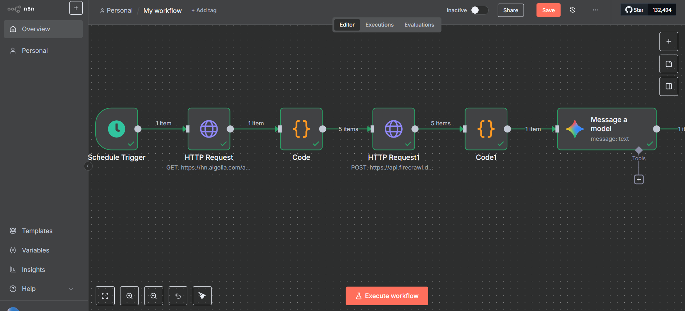
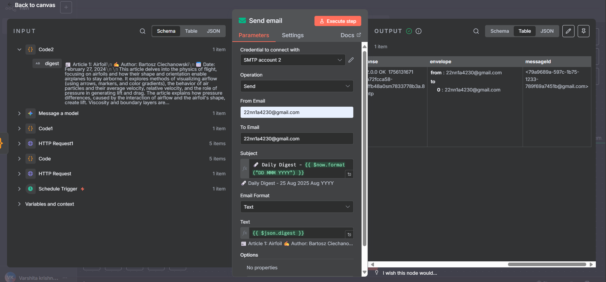
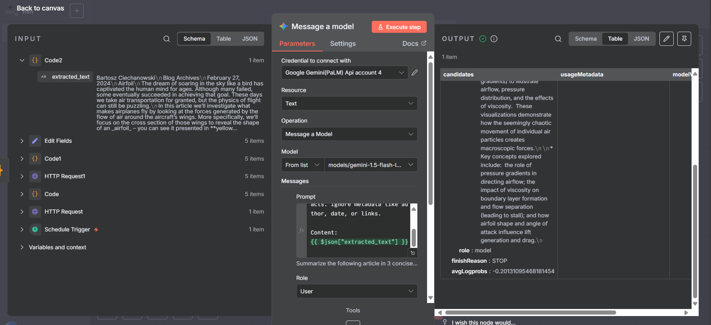
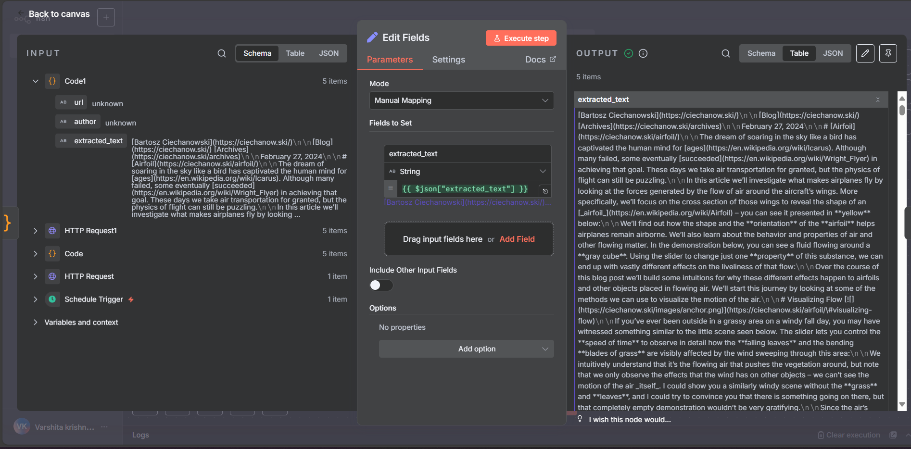

# 📰 n8n Daily Digest Agent

This project automates the extraction, summarization, and logging of daily news articles using **n8n**, triggered every day at **7:00 AM IST**. It integrates tools like **Firecrawl**, **Gemini**, and the **Notion API** to build a modular, scalable agent workflow.

This n8n workflow automatically extracts and summarizes the latest flash tech news every morning at 7:00 AM IST, then delivers a clean, digest-style email straight to your inbox. It uses Firecrawl for content extraction, Gemini for summarization, and formats the output into a readable daily briefing — no fluff, just fast-moving updates from the tech frontier.


## 🚀 Features

- ⏰ Scheduled trigger at 7:00 AM daily
- 🌐 News extraction via Firecrawl
- 🧠 Summarization using Gemini
- 📘 Logging to Notion database
- 🛠️ Error handling and fallback logic

---

## 🧩 Workflow Overview

### 🔹 Trigger Node (7:00 AM Daily)

This node starts the workflow every morning at 7 AM IST.


---

### 🔹 Firecrawl Integration

Extracts article content from a list of URLs.


---

### 🔹 Gemini Summarization

Summarizes the extracted content using Gemini API.

---

### 🔹 Notion Logging

Stores the summarized content in a Notion database with timestamp and source.

---

## 🛠 Setup Instructions

### 1. Clone the Repo

```bash
git clone https://github.com/your-username/n8n-daily-digest-agent.git
cd n8n-daily-digest-agent
```

### 2. Import Workflow

- Open your n8n instance
- Click **Import Workflow**
- Upload the `.json` file from `workflows/daily-digest.json`

### 3. Configure Credentials

Set up credentials for:
- Firecrawl API
- Gemini API
- Notion API

Use n8n’s **Credential Manager** to store them securely.

---

## 🧠 Notes

- Make sure your server timezone is set to IST or adjust the trigger accordingly.
- Handle broken URLs and API errors gracefully using IF nodes and fallback logic.
- Rotate API keys periodically to avoid quota issues.

---

## 📸 Screenshots







---

---


